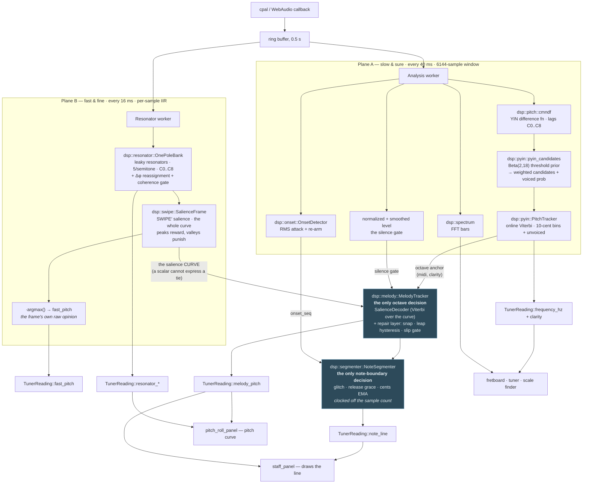

# Note detection — how the app decides what you played

The canonical description of the mechanism. If you are about to change anything about
pitch, octaves, note starts/ends, or latency, read this first — most of the mistakes
this pipeline has made were made twice, and the second time was because the shape of
it lived only in someone's head.

Companion docs: [`pitch_detection_survey.md`](pitch_detection_survey.md) (the
algorithms and why these ones) and [`violin_trainer_plan.md`](violin_trainer_plan.md)
(the phase-by-phase history, including what was reverted and why).

---

## 1. The one idea

**Two sources, opposite failure modes, each covering the other's.**

- The **resonator bank** is *fast*: it follows a note change in **8–29 ms**. It is the
  melody line's pitch, and its latency is the reason this design exists.
- **pYIN** is *octave-robust and slow*: rock steady during sustain, but its
  note-change latency equals its analysis window **exactly** — it will not leave a
  note while the window still holds any trace of it (**128 ms** at 6144 samples).

So the melody line takes **timing and fine pitch from the bank**, and borrows exactly
**one bit from pYIN: which octave**. That is the whole design. The perceptual
threshold for pitch feedback is ~30–40 ms; the bank fits inside it, pYIN never can.

### …and the two things that made the fast half trustworthy

The bank used to be *octave-naive*, and the melody line carried a **repair layer** to
patch that. Two phases removed the cause rather than the symptom, and both are load-
bearing enough that the repair layer is now expected to be redundant (it is still here —
§7 says why):

- **The scorer stopped being able to be wrong that way** (`dsp::swipe`, Phase 1.11). The
  old comb only ever *added* credit at a candidate's harmonics, and Camacho's thesis
  enumerates exactly that function and exactly its failure: a reward-only comb peaks at
  sub- **and supra**-harmonics. SWIPE′'s negative valleys punish 2·f0 for the energy at
  3·f0 and 5·f0 that lands in them. The phantom octave went **57% → 0%** of frames on a
  real bowed open G.
- **The fast channel got a model of time** (`dsp::trellis` + `melody::SalienceDecoder`).
  What SWIPE′ left behind was not a confident error but a **tie** — the right note losing
  to junk by 4–6%. No threshold can fix a tie, because the tie is in the evidence, not in
  the rule reading it. Continuity can: a lone excursion costs ~9.9 nats and buys back
  ~0.04, so it loses by ~225× and the path holds.

> **The trap, avoided on purpose.** "A jump of an octave or more is an error" is the
> intuitive rule and it is **wrong** — `testdata/g_open_real_octave.wav` is the user
> deliberately bowing an octave, and that rule would delete it. The difference between a
> phantom octave and a real one was never the interval. It is whether the evidence
> **persists**: a real leap's old note goes quiet so its emission collapses and it pays
> off the leap within a frame or three; a phantom's true note never leaves, so it never
> pays. That is a property of the path, and it needs no rule at all.

> **The mistake to not make again.** The other arrangement — fusing the bank *into*
> the pYIN HMM as a weighted candidate — was built, shipped, and **removed**. Off an
> onset it contributed exactly zero: the bank's candidate was capped at
> `BANK_WEIGHT × strength ≤ 0.5` while YIN's own candidate scores `p = 1.000`, so it
> lost every frame at any signal strength. Turning the weight up does not help
> either: the binding constraint is that YIN's *emission* for the old note stays at
> `p = 1.0` until the window flushes, and no candidate weight touches that. **The
> bank's speed only survives if the bank *is* the pitch.**
>
> **And the half that was not inert.** For weeks this section said the fusion was
> harmless dead weight. It was not, and the error is instructive: "inert" was measured
> for `BANK_WEIGHT` and then *assumed* for `ATTACK_BANK_WEIGHT`, which was 2.0 and
> rode a frame where the trellis had been dropped — so emissions alone decided it and
> the bank won outright. On an attack, pYIN echoed the bank's octave verbatim (window
> on a clean A4 + bank saying A5 → tracker says A5), and `dsp::melody` then consulted
> that echo as its independent octave witness. A claim measured for one constant is
> not a claim about its neighbour.

---

## 2. The flow

Both shaded boxes are **in the engine, on audio clocks**. Nothing below them decides
anything; the panels draw what they are handed (§3).

**Read the split as: `melody_pitch` is for panels that answer "what am I playing right
now"; `frequency_hz` is for panels that answer "am I in tune".** They want opposite
things — prompt vs steady — and that is why there are two.

---

## 3. Stage by stage

### Stage 0 — capture (`audio::native`, `audio::wasm`)

Device callback → a 0.5 s ring → **two independent workers**. Two, not one, because
the planes have different cadences and different costs, and the fast one must not wait
on the slow one.

The bank is **park-gated**: it only runs while a consumer keeps calling
`AudioEngine::request_resonator()` every frame (a CPU saving — it is per-sample IIR).
YIN runs unconditionally. **A panel that reads `melody_pitch` must request the bank**,
or it will sit at "play a note…" forever. The staff and pitch roll both do.

### Stage 1A — pYIN (slow, sure)

| | |
|---|---|
| Cadence | 40 ms (`ANALYSIS_INTERVAL`) |
| Window | 6144 samples = **128 ms** (`AnalysisSettings::window_size`) |
| Output | `frequency_hz`, `clarity` (= voiced probability) |

1. `cmndf` — YIN's cumulative mean normalized difference over lags C0..C8.
2. `pyin_candidates` — instead of one threshold, integrate YIN's pick over a
   Beta(2,18) *distribution* of 100 thresholds. Each period the picks land on becomes
   a candidate weighted by the prior mass that chose it; the mass that found no dip is
   the frame's unvoiced probability.
3. `PitchTracker::step` — online Viterbi over 10-cent bins + an unvoiced state,
   decoded greedily (argmax of the forward trellis).

The transition kernel mixes three things a player actually does, and all three are
load-bearing:

- `SELF_STAY` (0.8) — **hold**. Must dominate, or the nearly-free unvoiced self-loop
  out-races every voiced state and the tracker never commits to anything.
- Gaussian, `TRANS_SIGMA_CENTS` (70) — **glide/vibrato**, tens of cents per frame.
- `LEAP_MASS` (0.02), uniform — **jump**. Without real mass here a fifth sits 10σ out
  at `exp(−50)`; the design assumed leaps would route through the unvoiced state, but
  a *legato* leap never goes unvoiced, so that route is emission-blocked and the only
  escape left was to wait out the window. That was +120 ms on every octave.

### Stage 1B — the resonator bank (fast, fine)

| | |
|---|---|
| Cadence | 16 ms (`ResonatorSettings::update_ms`), fed per sample |
| Output | the **salience curve**, + `fast_pitch` = `(fractional_midi, strength)`, + the heat column |

A bank of leaky one-pole resonators, 5 per semitone across C0..C8, plus Δφ
**instantaneous-frequency reassignment** (super-resolution, with a coherence gate that
drops the negative-frequency image and noise). `dsp::swipe` then scores every bin *as a
fundamental* — see `docs/swipe_salience_design.md`, and §1 for why the scorer this
replaced could not be fixed, only replaced.

Two things about the output are easy to miss and both are deliberate:

- **The curve is the output; the argmax is a by-product.** An argmax throws away exactly
  what the next frame's decision needs — a 4–6% tie *is* the remaining error, and a
  scalar cannot express a tie. So `ResonatorSnapshot::salience` carries the whole curve
  (plus the raw column it was scored from, since the fine pitch is read off the winning
  series' loudest partial and continuity may pick a different series than the argmax did).
- **`fast_pitch` stays the frame's own raw opinion**, unsmoothed. `dsp::melody` borrows
  pYIN's octave to *cross-examine* the bank, and a witness already smoothed against its
  own past is a worse witness, not a better one. (This is the same error as Phase 1.5's
  fusion, in a new place: a mirror cannot be a witness.)

### Stage 2 — the decode (`dsp::melody::MelodyTracker`)

Runs at **plane B's cadence** and is the **only** place the melody line's octave is
decided. Two stages, and only the first has a model of time:

| stage | mechanism | what it does |
|---|---|---|
| 1 | **`SalienceDecoder`** — online Viterbi over the salience curve | decides the note, by continuity |
| 2 | the **repair layer** — snap · `LEAP_CONFIRM_FRAMES` · `OctaveGate` | patches a per-frame argmax that no longer exists (§7) |

**Stage 1** turns the curve into emissions through a Gibbs link, `exp(β·s)`, and runs it
through the shared trellis. Two properties of that link are not decoration:

- It is **shift-invariant**, so only salience *differences* ever reach the trellis. That
  is the structural form of the one thing SWIPE′'s scale means — its absolute value is
  normalized against a 480-resonator column and is an invented number, so only
  comparisons are assertable.
- `SALIENCE_BETA` (40) is the **exchange rate** between salience and nats, and it could
  **not** be inherited from pYIN. See §6.

**Stage 2** is the old repair layer. Its guards, both of which took a measurement to find:

- **`OCTAVE_AGREE_SEMITONES`** — for ~128 ms after a leap the anchor is still on the
  *previous* note. Snapping a fresh E5 (76) toward a stale A4 (69) computes
  `round((69−76)/12) = −1` and lands on **E4**. So the snap only fires when the two
  agree on the *pitch class*; otherwise the anchor is talking about a different note
  and the bank, being ~100 ms fresher, wins.
- **`LEAP_CONFIRM_FRAMES`** — an octave *leap* and an octave *slip* are the same pitch
  class, so the guard above provably cannot separate them. **Time** can: wandering's
  disagreement is intermittent (any correct frame resets the count), a real leap's is
  unbroken until the anchor catches up. Trusting the anchor here measured 261 ms.

  It is **1**, down from 4, and the reason is the sentence above: it is sized against the
  bank's *wandering*, and wandering is what stage 1 removed (bank octave slips are 0.0% of
  frames on both open-G takes). Not 0 — at 0 the bank wins every dispute on its first
  frame, which makes the snap return `bank_midi` unconditionally, i.e. dead code, taking
  `YIN_OCTAVE_CONFIDENCE` and the anchor dependency with it. **The snap and this constant
  are one mechanism, not two**, so they go together or not at all (§7).

A confirmed leap **resets the gate**. The `OctaveGate`'s median is still on the old
octave, so left alone it would reject the leap for another few frames out of inertia — a
second conservatism tax on a decision already paid for.

### Stage 2b — note segmentation (`dsp::segmenter::NoteSegmenter`)

Also at plane B's cadence, and the **only** place a note's start and end are decided.
Glitch rejection (`MIN_NOTE_SECONDS`), dropout grace (`RELEASE_SECONDS`) and the cents
average (`CENTS_EMA`) are all specified in *seconds*, so by §4's rule they may not be
driven by the UI. `now` is derived from the **sample count**, which additionally makes
a note's duration a musical quantity rather than a count of renderer ticks.

A rejected slip and silence both arrive here as `None`, deliberately — see §5.

### Stage 3 — the panels

Panels do **no DSP**. They read decided values and draw them.

- **staff** — `note_line` (the written notes, decided upstream) for the notation, plus
  `melody_since` for the waterfall behind them.
- **pitch roll** — `melody_since`: the line and the heat, from the same frames.
  The heat makes no octave decision at all, deliberately: it is the ground truth the
  line is checked against by eye. If the line disagrees with the heat under it, the
  line is wrong.

Neither reads a *history* off `TunerReading` any more — that is the instant, and
sampling it per repaint is what §4 is about.
- **fretboard / tuner / scale finder** — `frequency_hz`.

---

## 4. The two clocks

This is the part that bites, so it gets its own section.

| clock | rate | drives |
|---|---|---|
| **sample count** | exact, from the audio itself | note durations, the release grace |
| bank cadence | 16 ms, fixed | the octave dispute counter, the gate's median, the cents EMA |
| analysis cadence | 40 ms, fixed | the anchor, `onset_seq`, the level |
| **UI frame** | **60 fps — and *variable*** | drawing, and nothing else |

**Anything whose behaviour is specified in seconds must be driven by an audio clock,
not the UI clock.** Twice now a DSP filter has been found living in a panel with its
window measured in *frames*, so that a stuttering UI quietly changed its timescale and
the same code behaved differently at 30 fps and 60 fps:

- the `OctaveGate`'s median — moved into `melody` (Phase 1.8);
- note segmentation — moved into `segmenter` (Phase 1.9), where `now` comes from the
  sample count, so a note's length is sample-accurate rather than frame-quantised.

**Nothing is left on the UI clock — not even the decoration.** The panels' *history*
came off it last (`MelodyHistory`, below); what the UI frame decides now is only when
the pixels happen.

That last step was filed as cosmetic and was not. A panel sampling `melody_pitch` once
per repaint makes the **renderer the sampler**: the bank publishes at ~62 Hz, so a
60 fps panel dropped a few percent of its frames and a 30 fps one dropped **half** —
decimating exactly the trills and vibrato the fast path exists for, and making both
panels' x axis a count of renderer ticks ("~10 s at 60 fps, ~20 s at 30 fps"). The
staff was worse: its trail counted 240 UI frames across the width while the bank heat
*under* it counted 52 bank columns, so the two layers of one sound scrolled at ~200
and ~375 px/s. Reported live as "два водопада… один медленнее другой быстрее".

### `dsp::melody` → `MelodyFrame` → the panels

Every bank frame is published as one record — `seq`, `t`, `pitch`, `level`, `heat` —
and panels read it with a **cursor** (`AudioEngine::melody_since(after)`).

- **`t` is the ruler, not `seq`.** The publish is *gated on the wall clock*
  (`last_publish.elapsed() >= update_ms`) and fires on the first sample batch after the
  interval expires, so frames land ~16 ms apart **with jitter**: `seq × update_ms`
  would be a third wrong ruler. `t` comes off the sample count — the same clock §2b
  measures note durations with, so the line a panel plots and the notes the engine
  wrote are on one clock. A frame that never arrived then leaves a hole exactly where
  it belongs, and the line breaks over it rather than inventing a glide.
- **One frame carries both layers.** The heat is only the ground truth the line is
  checked against if it is the *same instant*; in one record it cannot be otherwise.
- **A cursor, not a drain.** Each consumer keeps its own, so the staff and the roll
  read the same frames instead of stealing them from each other.
- **`seq` survives `reset()`, `t` does not.** One answers "have I seen this frame", the
  other "when was it played": a panel's cursor outlives a device switch, the audio
  clock does not. A ring strictly increasing in `t` therefore heals itself across a
  stream restart with no epoch counter.
- **Trimmed by time, never by a frame count** — `update_ms` is user-adjustable over
  8..80 ms, so a ring measured in frames is not a span of seconds. That *is* the bug.
- **The heat is cheap because of the cursor.** The whole history is ~600 columns ×
  ~480 bins ≈ 70 MB/s if copied per read; a delta is 1–2 columns ≈ 0.23 MB/s. On wasm
  the worker cannot share memory, so it posts the delta and the main thread rebuilds
  the ring — same API both platforms.

**Still on a ruler of its own: the staff's noteheads.** They step left by a fixed
`gap * 3.2` per *note*, so a written note and the heat that produced it drift apart —
a third parallax, and unlike the other two it is a genuine design question (notation
is not a time plot), not a mistake. Untouched.

---

## 5. Ranges and gates

**Range** is one grid, `NOTE_BUCKET_MIN_MIDI..NOTE_BUCKET_MAX_MIDI` = **C0..C8**, and
everything else is expected to match it: `cmndf`'s lag bounds
(`LOWEST_TRACKED_FREQUENCY`..`HIGHEST_TRACKED_FREQUENCY`), pyin's HMM grid, the bank's
`min_midi..max_midi`.

> A ceiling here fails **silently and wrongly**, not by dropping notes. `yin_pick`
> scans lags upward and takes the first dip, so a note above the ceiling comes back as
> its own **sub-octave** — an octave flat. At the old `min_lag = sr/1000` (B5), C6, E6
> and A6 all measured exactly −12.00 semitones: the upper half of a violin's range,
> silently transposed down, on the tuner and fretboard as well as the staff.
> `pyin::tests::ceiling_probe` asserts this can't come back.

**Silence** is gated on absolute input `level`, in the engine
(`core::MELODY_LEVEL_GATE`), on the bank's input. It has to be *absolute*: the bank's
column is normalized to its own max, so it reports *some* fundamental for room noise
and nothing downstream can reconstruct silence from its output. The engine never
declares silence on its own (`SILENCE_RMS_THRESHOLD == 0.0`).

It used to sit in each panel, gating the melody line's *output*. That hid a detail:
the `MelodyTracker` upstream was fed raw bank pitch regardless, so its leap/slip
hysteresis stayed alive on room noise through every rest. Gating the *input* means
silence properly ends the phrase — and it had to move anyway, because the thing that
now needs to know the sound stopped (§2b) is in the engine.

> **⚠ The gate closes ~500 ms late, and ghost notes get written in the gap.**
> `input_level` is the *smoothed* level (`smoothed_level`, ×0.88 per 40 ms frame while
> falling) — smoothing that exists so the UI's level *meter* doesn't flicker, which the
> gate inherited by sharing the atomic. So after a note stops, the gate stays open for
> ~500 ms while the bank, unable to be quiet, reports whichever bins ring longest at
> full confidence. `OctaveGate` rejects the first ~50 ms, then its median moves onto the
> garbage and passes it. Reproduced by `core::tests::release_ghosts_are_written_after_a_note`.
> **How bad this is live is unknown**: the test cuts the tone off instantly, which no
> instrument does — a real note decays over hundreds of ms and the two may fall together.
> That is a question for the instrument. It is not new, and it is not caused by the
> segmenter's move; the move is what made it *visible*.

**A rejected frame reads as `None` — the same as silence.** This asymmetry is
deliberate and is why the gate returns `Option`: downstream, a missing frame is
absorbed by the staff's `RELEASE_SECONDS` grace and the held note survives, whereas a
wrong-octave frame reads as a pitch *change* — it commits the held note early, opens a
bogus one, and restarts the note's timer. With slips recurring, nothing ever reaches
`MIN_NOTE_SECONDS` and the staff writes **nothing at all**. That is not hypothetical;
it is how this was reported live.

---

## 6. The numbers

All measured, all reproducible as tests. Latency = ms from a real note change to the
value being available.

| path | ordinary interval | octave leap |
|---|---|---|
| resonator bank alone | **8–29 ms** | 8 ms |
| pYIN alone | **128 ms** (= window length, exactly) | 208 ms |
| plain YIN (pre-pYIN reference) | 128 ms | 128 ms |
| **melody line, to the engine's decision** | **24–40 ms** | **104 ms** |
| *(same path, measured to the UI frame that drew it — Phase 1.8)* | *28 ms* | *~110 ms* |
| *(staff, before Phase 1.7)* | *128 ms* | *328 ms* |
| perceptual threshold | ~30–40 ms | |

The low register pays more than the table's "ordinary" column: **G3→D4 is 104 ms** against
A4→E5's 40 ms, and they are the *same fifth*. The kernel geometry is identical; the bank is
constant-Q, so its ring-down is a roughly fixed number of *cycles* and therefore longer in
seconds the lower you go. While the old note still rings, its partials sit in the new
candidate's valleys and vote against it — and they are not wrong: it really is still
sounding. That is the price of the mechanism that took the phantom octave to 0%, not a
defect in it.

> **The top two rows are the same path measured at different points, not a speed-up.**
> Phase 1.9 moved segmentation into the engine, so the probe now stops when the engine
> *decides*; before, it stopped at the UI frame that *drew* the decision. Add up to one
> frame (≤17 ms at 60 fps) for the pixels. Nothing about the latency changed — only
> where the ruler ends.

pYIN's latency tracks its window length *exactly*, at every size — 1024→21 ms,
2048→43 ms, 6144→128 ms, 8192→171 ms. That is not a coincidence to be tuned around; it
is the HMM refusing to leave a note while the window holds a trace of it.

The octave leap is the only interval that pays `LEAP_CONFIRM_FRAMES`, and that is the
deliberate price of not re-breaking octave wandering. At **104 ms** it is now *faster* than
the 120 ms it was before the Viterbi existed, despite continuity also holding the note:
dropping that constant 4 → 1 more than paid for the Viterbi's own ~32 ms. Retiring the
repair layer entirely should take it to ~**88 ms**.

### The two constants that could not be inherited, and one that could

This is the most reusable thing this page knows, and it will matter again for **any** new
front end under the same trellis:

- **Transition rates transfer.** They describe how a *player's* pitch moves in time, which
  no detector changes. So pYIN's kernel — tuned and measured at 40 ms — carried over to the
  16 ms channel intact, as **rates per second** rather than per-frame probabilities (§4).
- **The emission scale does not.** pYIN's candidates are near-deltas: `p = 1.000` against a
  1e-9 floor is **20.7 nats** of contrast, so a leap's ~9.9 nats is pocket change to it.
  SWIPE′'s curve is broad and low-contrast — the right note leads by **0.017**. Inheriting
  the exchange rate silently priced every note change out of reach: the octave went 120 →
  **248 ms**, a whole tone 24 → **120 ms**. It compiles, and the tests that matter pass;
  it is just slow. Hence `SALIENCE_BETA`, and hence the Gibbs link.
- **`SALIENCE_BETA` is bounded from both sides, and one bound is invisible to the corpus.**
  Too high and the 4–6% ties buy their way through — the phantom returns. Too low and the
  needle **sticks**: at β=1 the stroke takes read a perfect **100%**, which is not accuracy
  but paralysis, because on a take whose note never changes a frozen decoder is always
  right. Only the latency sweep convicts it (`A4→B4` and `A4→A5` never arrive). **Two
  sweeps, always** — an accuracy corpus alone will always argue for over-smoothing.

### The tests that hold this

| test | asserts |
|---|---|
| `resonator::bank_latency_probe` | bank follows a change ≤ 40 ms |
| `segmenter::end_to_end_latency_probe` | the line shows a note ≤ 60 ms (≤ 130 ms octave / low register), through the *real* bank + tracker + melody + segmenter |
| `trellis::the_rates_are_dt_invariant_where_the_per_frame_constants_were_not` | the `update_ms` slider cannot move the detector: rates ×1.21 across 8..80 ms, **and the per-frame kernel it replaced ×10.0 on the same sweep** — the oracle must fail, or the test measures nothing |
| `trellis::kernel_reproduces_pyins_numbers_at_its_own_cadence` | the generalisation *is* pYIN's kernel at 40 ms (0.8 / 0.18 / 0.02), so its measured latency table carries over rather than restarting |
| `trellis::a_lone_outlier_does_not_move_the_path` / `sustained_evidence_moves_the_path` | the pair that separates a phantom octave from a real one — same interval, different persistence |
| `melody::beta_sweep::salience_beta_sweep` | `SALIENCE_BETA` against the whole corpus, incl. the `g_open_real_octave` control (the played G4 must **remain**) |
| `melody::beta_sweep::salience_beta_latency_sweep` | the other bound — the one that convicts a stuck needle |
| `swipe::the_old_comb_fails_the_same_column` | the non-circular half: the scorer SWIPE′ replaced **fails** the same input |
| `core::engine_writes_a_played_note_end_to_end` | a note reaches `note_line` through the real **engine wiring** — both pipelines, the level atomic, the onset hand-off, the sample clock |
| `core::the_melody_history_is_published_on_the_audio_clock` | `t` tracks the audio through the real pipelines; a cursor hands each frame over once; two cursors are independent |
| `pitch_roll_panel::history_is_paced_by_the_audio_not_the_frame_rate` | a panel repainting half as often still holds **every** bank frame (fed a trill, the case that dies first) |
| `pitch_roll_panel::the_visible_span_is_seconds_not_frames` | the visible span is seconds of audio, not a buffer length |
| `core::the_silence_gate_keeps_room_noise_off_the_line` | the silence gate is still connected |
| `core::release_ghosts_are_written_after_a_note` | pins the known bug in §5 |
| `pyin::ceiling_probe` | C0..E7 tracks with no octave error |
| `pyin::latency_probe` | reference numbers: window sweep, plain-YIN oracle |
| `pyin::short_window_accuracy_probe` | reference: accuracy vs window size |
| `melody::*` | each octave layer, and each guard, in isolation |
| `segmenter::*` | glitch/grace/re-attack, and that duration rides the supplied clock |
| `pitch_roll_panel::framing_keeps_the_rows_labellable` | framing stays tight enough for `pianoroll` to name notes, not just octaves |

> **The unit tests are not enough on their own, and that is a lesson too.** Every DSP
> test above either drives one module or composes them *by hand*. None of them touches
> the engine's **wiring** — the level atomic one plane writes and the other reads, the
> onset counter crossing between them, the sample clock, `note_line` being stamped by
> both publish paths without one blanking the other. A mistake there is invisible to
> the whole DSP suite and total to the user: the staff simply stays empty. That is why
> the `core::*` tests exist, and they are the ones that found §5's ghosts.

> **Why these exist at all.** Phases 1.4/1.5/1.6 each shipped marked "✅ DONE (built,
> not live-verified)", and **not one** had a test that measured latency — every pYIN
> test fed the *same window* repeatedly, which cannot observe a note change by
> construction. That is how a change that cost ~100 ms shipped looking like a
> simplification. A design that trades latency for tidiness must now fail a test, not
> a live session weeks later.

---

## 7. Rules

1. **Don't draw the melody line from `frequency_hz`.** It is pYIN alone and cannot be
   prompt. It is correct for the tuner and fretboard, where steady beats prompt.
2. **Don't re-fuse the bank into the pYIN HMM.** It is gone (§1). Off an onset it is
   provably inert; on one it makes pYIN's octave an echo of the bank's, which quietly
   destroys the independence `dsp::melody` weighs it for. If you try again, the
   question to answer first is not "what weight?" but "is the anchor still independent
   evidence?"
3. **The octave is decided in `dsp::melody`, once.** Not in a panel, not per-consumer.
   If a new panel needs a melody line, it reads `melody_pitch`.
4. **Anything specified in seconds runs on an audio clock**, at a stated cadence — not
   per UI frame (§4).
5. **Range bounds move together** (§5), and a ceiling gets a test, because it fails
   silently.
6. **Latency claims are measured, not reasoned.** Every number here came from a probe;
   several contradicted a comment in the code that read perfectly plausibly.
7. **There is one trellis** (`dsp::trellis`), and a new detector supplies *emissions*, not
   a second copy of the continuity model. How a player's pitch moves in time is a property
   of the instrument; it does not fork per front end. But **re-measure the emission scale**
   — it does not transfer (§6).
8. **A per-frame constant in `dsp::` is a bug in waiting.** The frame is `update_ms`, an
   8..80 ms *display* slider, so "per frame" means "per whatever the user dragged it to".
   Specify rates per second and discretize with a real `dt` off the **sample clock**. This
   was the fourth time a display setting silently steered this detector (after the UI
   meter's smoothing, `gamma`, and the waterfall's C0..C8 extent) — and the first to leak
   as a *clock* rather than a value, which is why the earlier trigger missed it.
   `melody::LEAP_CONFIRM_FRAMES` and `segmenter`'s hardcoded `bank_publish_ms = 16.0` are
   the two that remain.
9. **The repair layer is still here, and that is on purpose.** `snap_to_anchor_octave`,
   `LEAP_CONFIRM_FRAMES`, `OctaveGate` and the anchor dependency all patch a per-frame
   argmax that stage 1 replaced, so they are expected to be redundant — but the evidence is
   **two strings**, G and A. Retiring them on that would be this plan's own recurring
   mistake: a number verified in one condition, restated as a property. The gate is
   recordings of D and E (`testdata/README.md`); then they go **in one piece**, because the
   snap and `LEAP_CONFIRM_FRAMES` are one mechanism and removing either alone leaves dead
   code behind.
