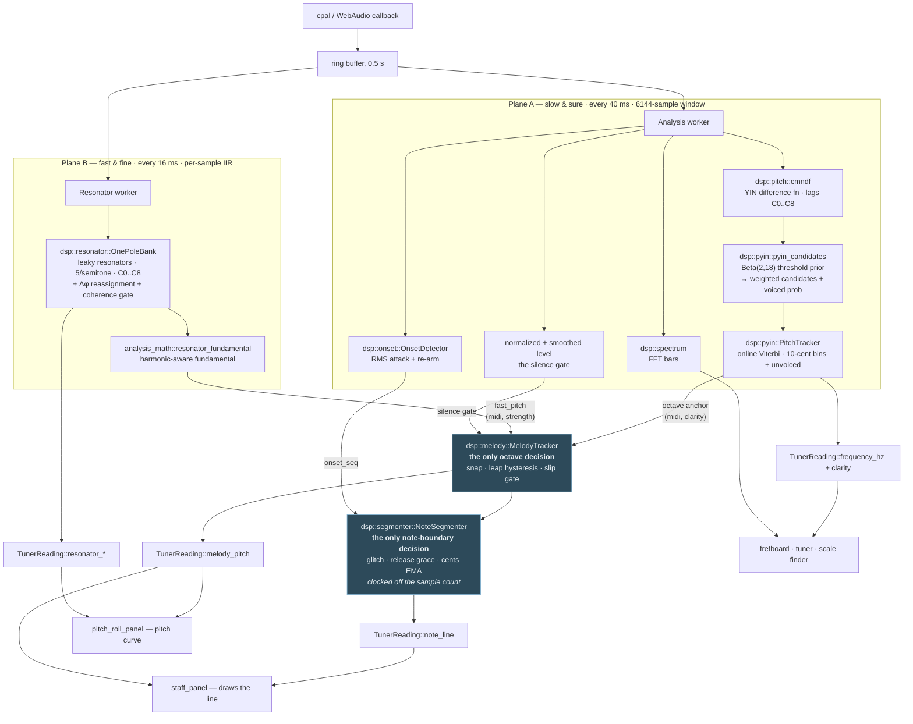

# Note detection — how the app decides what you played

The canonical description of the mechanism. If you are about to change anything about
pitch, octaves, note starts/ends, or latency, read this first — most of the mistakes
this pipeline has made were made twice, and the second time was because the shape of
it lived only in someone's head.

Companion docs: [`pitch_detection_survey.md`](pitch_detection_survey.md) (the
algorithms and why these ones) and [`violin_trainer_plan.md`](violin_trainer_plan.md)
(the phase-by-phase history, including what was reverted and why).

---

## 1. The one idea

**Two sources, opposite failure modes, each covering the other's.**

- The **resonator bank** is *fast and octave-naive*: it follows a note change in
  **8–29 ms**, but on a bowed string its harmonic scoring can crown an overtone and
  wander an octave.
- **pYIN** is *octave-robust and slow*: rock steady during sustain, but its
  note-change latency equals its analysis window **exactly** — it will not leave a
  note while the window still holds any trace of it (**128 ms** at 6144 samples).

So the melody line takes **timing and fine pitch from the bank**, and borrows exactly
**one bit from pYIN: which octave**. That is the whole design. The perceptual
threshold for pitch feedback is ~30–40 ms; the bank fits inside it, pYIN never can.

> **The mistake to not make again.** The other arrangement — fusing the bank *into*
> the pYIN HMM as a weighted candidate — was built, shipped, and measured to
> contribute **exactly zero**. The bank's candidate is capped at
> `BANK_WEIGHT × strength ≤ 0.5` while YIN's own candidate scores `p = 1.000`, so it
> loses every frame at any signal strength. Turning the weight up does not help
> either: the binding constraint is that YIN's *emission* for the old note stays at
> `p = 1.0` until the window flushes, and no candidate weight touches that. **The
> bank's speed only survives if the bank *is* the pitch.**

---

## 2. The flow

Both shaded boxes are **in the engine, on audio clocks**. Nothing below them decides
anything; the panels draw what they are handed (§3).

**Read the split as: `melody_pitch` is for panels that answer "what am I playing right
now"; `frequency_hz` is for panels that answer "am I in tune".** They want opposite
things — prompt vs steady — and that is why there are two.

---

## 3. Stage by stage

### Stage 0 — capture (`audio::native`, `audio::wasm`)

Device callback → a 0.5 s ring → **two independent workers**. Two, not one, because
the planes have different cadences and different costs, and the fast one must not wait
on the slow one.

The bank is **park-gated**: it only runs while a consumer keeps calling
`AudioEngine::request_resonator()` every frame (a CPU saving — it is per-sample IIR).
YIN runs unconditionally. **A panel that reads `melody_pitch` must request the bank**,
or it will sit at "play a note…" forever. The staff and pitch roll both do.

### Stage 1A — pYIN (slow, sure)

| | |
|---|---|
| Cadence | 40 ms (`ANALYSIS_INTERVAL`) |
| Window | 6144 samples = **128 ms** (`AnalysisSettings::window_size`) |
| Output | `frequency_hz`, `clarity` (= voiced probability) |

1. `cmndf` — YIN's cumulative mean normalized difference over lags C0..C8.
2. `pyin_candidates` — instead of one threshold, integrate YIN's pick over a
   Beta(2,18) *distribution* of 100 thresholds. Each period the picks land on becomes
   a candidate weighted by the prior mass that chose it; the mass that found no dip is
   the frame's unvoiced probability.
3. `PitchTracker::step` — online Viterbi over 10-cent bins + an unvoiced state,
   decoded greedily (argmax of the forward trellis).

The transition kernel mixes three things a player actually does, and all three are
load-bearing:

- `SELF_STAY` (0.8) — **hold**. Must dominate, or the nearly-free unvoiced self-loop
  out-races every voiced state and the tracker never commits to anything.
- Gaussian, `TRANS_SIGMA_CENTS` (70) — **glide/vibrato**, tens of cents per frame.
- `LEAP_MASS` (0.02), uniform — **jump**. Without real mass here a fifth sits 10σ out
  at `exp(−50)`; the design assumed leaps would route through the unvoiced state, but
  a *legato* leap never goes unvoiced, so that route is emission-blocked and the only
  escape left was to wait out the window. That was +120 ms on every octave.

### Stage 1B — the resonator bank (fast, fine)

| | |
|---|---|
| Cadence | 16 ms (`ResonatorSettings::update_ms`), fed per sample |
| Output | `fast_pitch` = `(fractional_midi, strength)`, + the heat column |

A bank of leaky one-pole resonators, 5 per semitone across C0..C8, plus Δφ
**instantaneous-frequency reassignment** (super-resolution, with a coherence gate that
drops the negative-frequency image and noise). `resonator_fundamental` then scores
every bin *as a fundamental* — summing its first harmonics at fixed `+12·log2(h)`
offsets, weighted `1/h`, and requiring real energy at the bin itself — which beats a
plain argmax on both octave-up (crowned overtone) and sub-octave (half-pitch phantom).

This is the melody line's pitch. Its latency is the reason the design exists.

### Stage 2 — the fusion (`dsp::melody::MelodyTracker`)

Runs at **plane B's cadence** and is the **only** place the melody line's octave is
decided. Three layers, each covering the previous one's blind spot:

| layer | mechanism | covers |
|---|---|---|
| 1 | the bank's harmonic scoring (upstream) | its best single-frame guess |
| 2 | **snap** to pYIN's octave | the bank's wandering, whenever pYIN is confident |
| 3 | **`OctaveGate`** median | a slip on a frame where pYIN had *no* opinion — exactly when layer 2 stands down |

Two guards on the snap, both of which took a measurement to find:

- **`OCTAVE_AGREE_SEMITONES`** — for ~128 ms after a leap the anchor is still on the
  *previous* note. Snapping a fresh E5 (76) toward a stale A4 (69) computes
  `round((69−76)/12) = −1` and lands on **E4**. So the snap only fires when the two
  agree on the *pitch class*; otherwise the anchor is talking about a different note
  and the bank, being ~100 ms fresher, wins.
- **`LEAP_CONFIRM_FRAMES`** — an octave *leap* and an octave *slip* are the same pitch
  class, so the guard above provably cannot separate them. **Time** can: wandering's
  disagreement is intermittent (any correct frame resets the count), a real leap's is
  unbroken until the anchor catches up. Trusting the anchor here measured 261 ms.

A confirmed leap **resets the gate**. Layer 3's median is still on the old octave, so
left alone it would reject the leap for another few frames out of inertia — a second
conservatism tax on a decision layer 2 already paid for over five frames.

### Stage 2b — note segmentation (`dsp::segmenter::NoteSegmenter`)

Also at plane B's cadence, and the **only** place a note's start and end are decided.
Glitch rejection (`MIN_NOTE_SECONDS`), dropout grace (`RELEASE_SECONDS`) and the cents
average (`CENTS_EMA`) are all specified in *seconds*, so by §4's rule they may not be
driven by the UI. `now` is derived from the **sample count**, which additionally makes
a note's duration a musical quantity rather than a count of renderer ticks.

A rejected slip and silence both arrive here as `None`, deliberately — see §5.

### Stage 3 — the panels

Panels do **no DSP**. They read decided values and draw them.

- **staff** — `note_line` (the written notes, decided upstream) for the notation, plus
  `melody_pitch` for the decorative trail.
- **pitch roll** — `melody_pitch` (the line) + the raw resonator column (the heat).
  The heat makes no octave decision at all, deliberately: it is the ground truth the
  line is checked against by eye. If the line disagrees with the heat under it, the
  line is wrong.
- **fretboard / tuner / scale finder** — `frequency_hz`.

---

## 4. The two clocks

This is the part that bites, so it gets its own section.

| clock | rate | drives |
|---|---|---|
| **sample count** | exact, from the audio itself | note durations, the release grace |
| bank cadence | 16 ms, fixed | the octave dispute counter, the gate's median, the cents EMA |
| analysis cadence | 40 ms, fixed | the anchor, `onset_seq`, the level |
| **UI frame** | **60 fps — and *variable*** | drawing, and nothing else |

**Anything whose behaviour is specified in seconds must be driven by an audio clock,
not the UI clock.** Twice now a DSP filter has been found living in a panel with its
window measured in *frames*, so that a stuttering UI quietly changed its timescale and
the same code behaved differently at 30 fps and 60 fps:

- the `OctaveGate`'s median — moved into `melody` (Phase 1.8);
- note segmentation — moved into `segmenter` (Phase 1.9), where `now` comes from the
  sample count, so a note's length is sample-accurate rather than frame-quantised.

**No decision is left on the UI clock.** What remains sampled per UI frame is
*decoration*, and is only tolerable because nothing is decided from it:

- the staff's pitch **trail** — a fading glow; a dropped frame costs one dot;
- the pitch roll's **history** — 600 frames wide, so its time axis is still not time
  (its own comment admits "~10 s at 60 fps, ~20 s at 30 fps"). The *line's* values are
  decided upstream and merely sampled late; the axis they are plotted against is the
  wrong ruler. Fixing it needs an engine-side history the panel drains by sequence
  rather than per frame, and a decision about the heat's cost: the two layers must stay
  aligned 1:1, and 600 columns × ~480 bins on every reading is ~70 MB/s of copying.
  Not yet done.

---

## 5. Ranges and gates

**Range** is one grid, `NOTE_BUCKET_MIN_MIDI..NOTE_BUCKET_MAX_MIDI` = **C0..C8**, and
everything else is expected to match it: `cmndf`'s lag bounds
(`LOWEST_TRACKED_FREQUENCY`..`HIGHEST_TRACKED_FREQUENCY`), pyin's HMM grid, the bank's
`min_midi..max_midi`.

> A ceiling here fails **silently and wrongly**, not by dropping notes. `yin_pick`
> scans lags upward and takes the first dip, so a note above the ceiling comes back as
> its own **sub-octave** — an octave flat. At the old `min_lag = sr/1000` (B5), C6, E6
> and A6 all measured exactly −12.00 semitones: the upper half of a violin's range,
> silently transposed down, on the tuner and fretboard as well as the staff.
> `pyin::tests::ceiling_probe` asserts this can't come back.

**Silence** is gated on absolute input `level`, in the engine
(`core::MELODY_LEVEL_GATE`), on the bank's input. It has to be *absolute*: the bank's
column is normalized to its own max, so it reports *some* fundamental for room noise
and nothing downstream can reconstruct silence from its output. The engine never
declares silence on its own (`SILENCE_RMS_THRESHOLD == 0.0`).

It used to sit in each panel, gating the melody line's *output*. That hid a detail:
the `MelodyTracker` upstream was fed raw bank pitch regardless, so its leap/slip
hysteresis stayed alive on room noise through every rest. Gating the *input* means
silence properly ends the phrase — and it had to move anyway, because the thing that
now needs to know the sound stopped (§2b) is in the engine.

> **⚠ The gate closes ~500 ms late, and ghost notes get written in the gap.**
> `input_level` is the *smoothed* level (`smoothed_level`, ×0.88 per 40 ms frame while
> falling) — smoothing that exists so the UI's level *meter* doesn't flicker, which the
> gate inherited by sharing the atomic. So after a note stops, the gate stays open for
> ~500 ms while the bank, unable to be quiet, reports whichever bins ring longest at
> full confidence. `OctaveGate` rejects the first ~50 ms, then its median moves onto the
> garbage and passes it. Reproduced by `core::tests::release_ghosts_are_written_after_a_note`.
> **How bad this is live is unknown**: the test cuts the tone off instantly, which no
> instrument does — a real note decays over hundreds of ms and the two may fall together.
> That is a question for the instrument. It is not new, and it is not caused by the
> segmenter's move; the move is what made it *visible*.

**A rejected frame reads as `None` — the same as silence.** This asymmetry is
deliberate and is why the gate returns `Option`: downstream, a missing frame is
absorbed by the staff's `RELEASE_SECONDS` grace and the held note survives, whereas a
wrong-octave frame reads as a pitch *change* — it commits the held note early, opens a
bogus one, and restarts the note's timer. With slips recurring, nothing ever reaches
`MIN_NOTE_SECONDS` and the staff writes **nothing at all**. That is not hypothetical;
it is how this was reported live.

---

## 6. The numbers

All measured, all reproducible as tests. Latency = ms from a real note change to the
value being available.

| path | ordinary interval | octave leap |
|---|---|---|
| resonator bank alone | **8–29 ms** | 8 ms |
| pYIN alone | **128 ms** (= window length, exactly) | 208 ms |
| plain YIN (pre-pYIN reference) | 128 ms | 128 ms |
| **melody line, to the engine's decision** | **24–40 ms** | **72 ms** |
| *(same path, measured to the UI frame that drew it — Phase 1.8)* | *28 ms* | *78 ms* |
| *(staff, before Phase 1.7)* | *128 ms* | *328 ms* |
| perceptual threshold | ~30–40 ms | |

> **The top two rows are the same path measured at different points, not a speed-up.**
> Phase 1.9 moved segmentation into the engine, so the probe now stops when the engine
> *decides*; before, it stopped at the UI frame that *drew* the decision. Add up to one
> frame (≤17 ms at 60 fps) for the pixels. Nothing about the latency changed — only
> where the ruler ends.

pYIN's latency tracks its window length *exactly*, at every size — 1024→21 ms,
2048→43 ms, 6144→128 ms, 8192→171 ms. That is not a coincidence to be tuned around; it
is the HMM refusing to leave a note while the window holds a trace of it.

The octave leap is the only interval that pays `LEAP_CONFIRM_FRAMES`, and that is the
deliberate price of not re-breaking octave wandering.

### The tests that hold this

| test | asserts |
|---|---|
| `resonator::bank_latency_probe` | bank follows a change ≤ 40 ms |
| `segmenter::end_to_end_latency_probe` | the line shows a note ≤ 60 ms (≤ 100 ms octave), through the *real* bank + tracker + melody + segmenter |
| `core::engine_writes_a_played_note_end_to_end` | a note reaches `note_line` through the real **engine wiring** — both pipelines, the level atomic, the onset hand-off, the sample clock |
| `core::the_silence_gate_keeps_room_noise_off_the_line` | the silence gate is still connected |
| `core::release_ghosts_are_written_after_a_note` | pins the known bug in §5 |
| `pyin::ceiling_probe` | C0..E7 tracks with no octave error |
| `pyin::latency_probe` | reference numbers: window sweep, plain-YIN oracle |
| `pyin::short_window_accuracy_probe` | reference: accuracy vs window size |
| `melody::*` | each octave layer, and each guard, in isolation |
| `segmenter::*` | glitch/grace/re-attack, and that duration rides the supplied clock |
| `pitch_roll_panel::framing_keeps_the_rows_labellable` | framing stays tight enough for `pianoroll` to name notes, not just octaves |

> **The unit tests are not enough on their own, and that is a lesson too.** Every DSP
> test above either drives one module or composes them *by hand*. None of them touches
> the engine's **wiring** — the level atomic one plane writes and the other reads, the
> onset counter crossing between them, the sample clock, `note_line` being stamped by
> both publish paths without one blanking the other. A mistake there is invisible to
> the whole DSP suite and total to the user: the staff simply stays empty. That is why
> the `core::*` tests exist, and they are the ones that found §5's ghosts.

> **Why these exist at all.** Phases 1.4/1.5/1.6 each shipped marked "✅ DONE (built,
> not live-verified)", and **not one** had a test that measured latency — every pYIN
> test fed the *same window* repeatedly, which cannot observe a note change by
> construction. That is how a change that cost ~100 ms shipped looking like a
> simplification. A design that trades latency for tidiness must now fail a test, not
> a live session weeks later.

---

## 7. Rules

1. **Don't draw the melody line from `frequency_hz`.** It is pYIN alone and cannot be
   prompt. It is correct for the tuner and fretboard, where steady beats prompt.
2. **Don't fix latency by tuning `BANK_WEIGHT`.** That fusion is inert and provably
   cannot be otherwise (§1).
3. **The octave is decided in `dsp::melody`, once.** Not in a panel, not per-consumer.
   If a new panel needs a melody line, it reads `melody_pitch`.
4. **Anything specified in seconds runs on an audio clock**, at a stated cadence — not
   per UI frame (§4).
5. **Range bounds move together** (§5), and a ceiling gets a test, because it fails
   silently.
6. **Latency claims are measured, not reasoned.** Every number here came from a probe;
   several contradicted a comment in the code that read perfectly plausibly.
